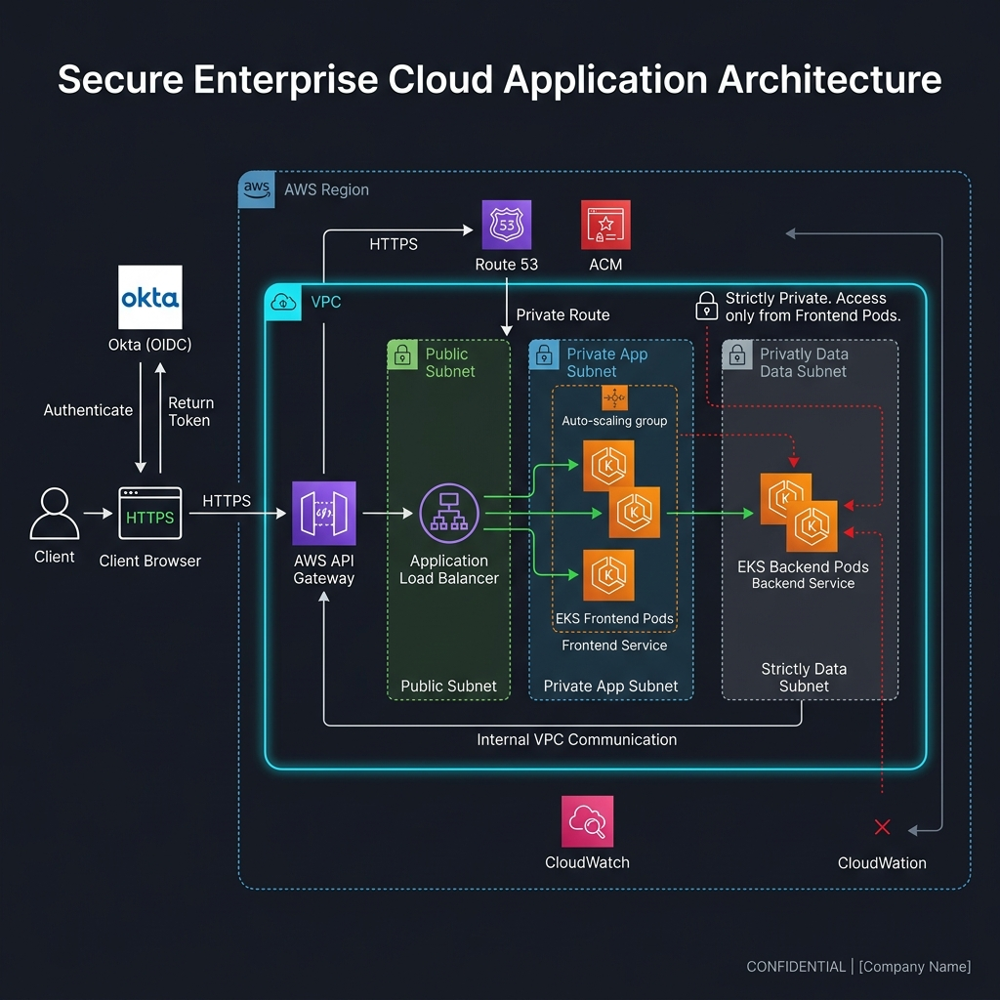
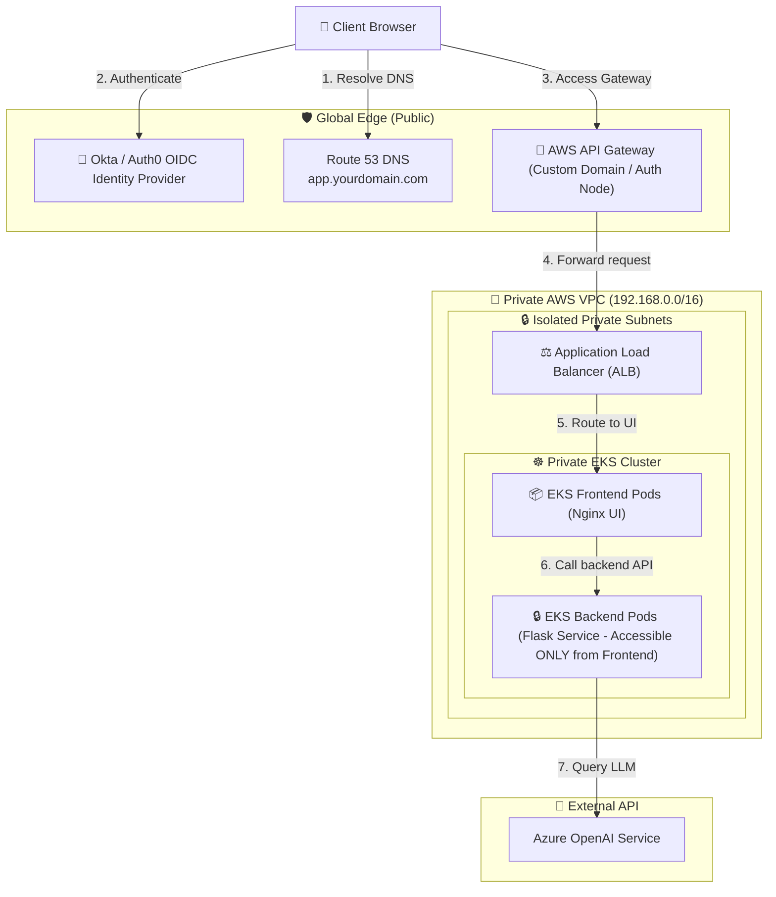

# CLIENT HANDOVER DOCUMENT: Zero-Trust Private EKS & Edge Security Infrastructure

---

## 1. Project Overview & Objectives

This handover document defines the deployment, request routing, and maintenance operations of the enterprise-grade AI Chat Application infrastructure.

The core objective is to deliver a **Zero-Trust networking architecture** on AWS:
*   **Zero Public Workloads**: No EKS worker nodes, databases, or API handlers are exposed to the public internet. All application resources reside in non-routable private subnets.
*   **Isolated Kubernetes Control Plane**: The EKS cluster API endpoint is set to private-access only. Management is restricted to local VPC routes.
*   **Edge-Level Security Enforcement**: User authentication (OIDC PKCE validation via Lambda@Edge), SSL/TLS termination, and application threat protection (AWS WAF rate limiting) are enforced globally at the AWS CDN Edge (CloudFront) before requests ever enter the network perimeter.

---

## 2. Infrastructure Architecture Blueprint

Here is the high-resolution architecture diagram detailing the network routes, logical groups, and connections:



The following sequence details how traffic safely routes through the edge, VPC, and cluster layers:



---

## 3. Step-by-Step Creation & Connection Recipes

Follow these step-by-step code blocks to deploy and configure every single component from scratch.

### Step 1: Create the Private VPC Network
We provision a VPC containing isolated private subnets for EKS and the load balancers, along with public subnets for NAT gateways.

```bash
# 1. Create the VPC
VPC_ID=$(aws ec2 create-vpc --cidr-block 192.168.0.0/16 --query 'Vpc.VpcId' --output text)
aws ec2 create-tags --resources $VPC_ID --tags Key=Name,Value=eks-private-vpc

# 2. Enable DNS features required for private endpoints
aws ec2 modify-vpc-attribute --vpc-id $VPC_ID --enable-dns-support "{\"Value\":true}"
aws ec2 modify-vpc-attribute --vpc-id $VPC_ID --enable-dns-hostnames "{\"Value\":true}"

# 3. Create private subnets for EKS Nodes & Internal LBs
SUBNET_PRV1=$(aws ec2 create-subnet --vpc-id $VPC_ID --cidr-block 192.168.100.0/24 --availability-zone us-east-1a --query 'Subnet.SubnetId' --output text)
SUBNET_PRV2=$(aws ec2 create-subnet --vpc-id $VPC_ID --cidr-block 192.168.200.0/24 --availability-zone us-east-1b --query 'Subnet.SubnetId' --output text)
aws ec2 create-tags --resources $SUBNET_PRV1 --tags Key=Name,Value=eks-private-1 Key=kubernetes.io/role/internal-elb,Value=1
aws ec2 create-tags --resources $SUBNET_PRV2 --tags Key=Name,Value=eks-private-2 Key=kubernetes.io/role/internal-elb,Value=1
```

---

### Step 2: Provision EKS Cluster (Private-Only Mode)
We deploy a private EKS cluster that sits solely inside the private subnets.

1. Create a `cluster-config.yaml` file:
```yaml
apiVersion: eksctl.io/v1alpha5
kind: ClusterConfig

metadata:
  name: enterprise-eks
  region: us-east-1
  version: "1.30"

vpc:
  id: "VPC_ID" # Replace with $VPC_ID
  subnets:
    private:
      us-east-1a: { id: "SUBNET_PRV1" } # Replace with $SUBNET_PRV1
      us-east-1b: { id: "SUBNET_PRV2" } # Replace with $SUBNET_PRV2
  clusterEndpoints:
    publicAccess: false
    privateAccess: true

managedNodeGroups:
  - name: private-nodes
    instanceType: t3.medium
    desiredCapacity: 2
    privateNetworking: true
```

2. Trigger creation:
```bash
eksctl create cluster -f cluster-config.yaml
```

---

### Step 3: Launch the SSM EC2 Bastion Host (Cluster Admin Gateway)

> [!IMPORTANT]
> **Why we need the Bastion Host**: 
> Once the EKS Cluster endpoint access is restricted to **Private-Only** (meaning it has no public internet IP address), administrators can no longer manage the cluster using `kubectl` from their local machines. 
> 
> **How we secure it**: 
> To manage the cluster, we deploy an EC2 instance (Bastion Host) inside the private subnet of the VPC. 
> * We do **NOT** open Port 22 (SSH) on this instance. Instead, we use **AWS Systems Manager (SSM) Session Manager** to establish secure, encrypted shell sessions through the AWS Systems Manager service agent.
> * We attach an EKS Access Entry to the Bastion's IAM Instance Profile, giving it administrative control. All cluster management commands are safely run from this host.

1. Create an IAM Instance Role Profile with SSM permissions:
```json
{
  "Version": "2012-10-17",
  "Statement": [
    {
      "Effect": "Allow",
      "Principal": {
        "Service": "ec2.amazonaws.com"
      },
      "Action": "sts:AssumeRole"
    }
  ]
}
```

# Create IAM Role
aws iam create-role --role-name BastionSSMAdminRole --assume-role-policy-document file://trust-policy.json
aws iam attach-role-policy --role-name BastionSSMAdminRole --policy-arn arn:aws:iam::aws:policy/AmazonSSMManagedInstanceCore

# Create instance profile and bind to role
aws iam create-instance-profile --instance-profile-name BastionInstanceProfile
aws iam add-role-to-instance-profile --instance-profile-name BastionInstanceProfile --role-name BastionSSMAdminRole
```

2. Run the EC2 Instance:
```bash
# Launch instance in a subnet with internet access to download tools (or configure VPC Endpoint)
BASTION_ID=$(aws ec2 run-instances \
  --image-id ami-0440d3b780d96b29d \
  --instance-type t3.micro \
  --iam-instance-profile Name=BastionInstanceProfile \
  --subnet-id $SUBNET_PRV1 \
  --security-group-ids $SECURITY_GROUP \
  --query 'Instances[0].InstanceId' --output text)
```

3. Configure EKS Cluster Access for the Bastion IAM role:
```bash
# Add Bastion Admin IAM role to EKS access entries
eksctl create accessentry \
  --cluster enterprise-eks \
  --principal-arn arn:aws:iam::YOUR_AWS_ACCOUNT_ID:role/BastionSSMAdminRole \
  --type STANDARD

# Grant Cluster Admin permissions
eksctl associate-iamidentitymapping \
  --cluster enterprise-eks \
  --arn arn:aws:iam::YOUR_AWS_ACCOUNT_ID:role/BastionSSMAdminRole \
  --group system:masters
```

---

### Step 4: Install the AWS Load Balancer Controller
This controller allows EKS to create AWS Application Load Balancers (ALB) and Network Load Balancers (NLB).

1. Create the IAM Policy & Role:
```bash
curl -o iam_policy.json https://raw.githubusercontent.com/kubernetes-sigs/aws-load-balancer-controller/main/docs/install/iam_policy.json
aws iam create-policy --policy-name AWSLoadBalancerControllerIAMPolicy --policy-document file://iam_policy.json

# Create service account and bind IAM role
eksctl create iamserviceaccount \
  --cluster=enterprise-eks \
  --namespace=kube-system \
  --name=aws-load-balancer-controller \
  --role-name AmazonEKSLoadBalancerControllerRole \
  --attach-policy-arn=arn:aws:iam::YOUR_AWS_ACCOUNT_ID:policy/AWSLoadBalancerControllerIAMPolicy \
  --approve
```

2. Install using Helm:
```bash
helm repo add eks https://aws.github.com/eks-charts
helm install aws-load-balancer-controller eks/aws-load-balancer-controller \
  -n kube-system \
  --set clusterName=enterprise-eks \
  --set serviceAccount.create=false \
  --set serviceAccount.name=aws-load-balancer-controller
```

---

### Step 5: Deploy Flask Backend & Internal NLB
We deploy our Flask backend pods and expose them internally using a Network Load Balancer (NLB).

```yaml
# backend-service.yaml
apiVersion: apps/v1
kind: Deployment
metadata:
  name: backend
spec:
  replicas: 2
  selector:
    matchLabels:
      app: backend
  template:
    metadata:
      labels:
        app: backend
    spec:
      containers:
        - name: backend
          image: YOUR_AWS_ACCOUNT_ID.dkr.ecr.us-east-1.amazonaws.com/test-backend:latest
          ports:
            - containerPort: 5000
---
apiVersion: v1
kind: Service
metadata:
  name: backend-service
  annotations:
    service.beta.kubernetes.io/aws-load-balancer-type: "nlb"
    service.beta.kubernetes.io/aws-load-balancer-scheme: "internal"
spec:
  type: LoadBalancer
  ports:
    - port: 5000
      targetPort: 5000
  selector:
    app: backend
```

Deploy the backend manifest:
```bash
kubectl apply -f backend-service.yaml
```

---

### Step 6: Create VPC Link & Private API Gateway
We configure the API Gateway to route private VPC requests to our internal NLB.

1. Retrieve the NLB ARN from the backend service:
```bash
NLB_ARN=$(aws elbv2 describe-load-balancers --query 'LoadBalancers[?contains(DNSName, `k8s-default-backendse`)].LoadBalancerArn' --output text)
```

2. Create the VPC Link:
```bash
VPC_LINK_ID=$(aws apigateway create-vpc-link \
  --name "backend-vpc-link" \
  --target-arns "$NLB_ARN" \
  --query 'id' --output text)
```

3. Create the Private API Gateway:
```bash
# Define resource policy to restrict invocation strictly to our VPC Endpoint
cat <<EOF > policy.json
{
  "Version": "2012-10-17",
  "Statement": [
    {
      "Effect": "Deny",
      "Principal": "*",
      "Action": "execute-api:Invoke",
      "Resource": "arn:aws:execute-api:us-east-1:YOUR_AWS_ACCOUNT_ID:*/*",
      "Condition": {
        "StringNotEquals": {
          "aws:sourceVpce": "vpce-0ce2907e3ad7faf8f"
        }
      }
    },
    {
      "Effect": "Allow",
      "Principal": "*",
      "Action": "execute-api:Invoke",
      "Resource": "arn:aws:execute-api:us-east-1:YOUR_AWS_ACCOUNT_ID:*/*"
    }
  ]
}
EOF

API_ID=$(aws apigateway create-rest-api \
  --name "Private Chat API" \
  --endpoint-configuration types=PRIVATE,vpcEndpointIds=vpce-0ce2907e3ad7faf8f \
  --policy file://policy.json \
  --query 'id' --output text)
```

---

### Step 7: Create VPC Interface Endpoint (execute-api)
We create a private interface endpoint to connect our frontend EKS pods to the API Gateway.

```bash
# Create Security Group for Endpoint
SG_ID=$(aws ec2 create-security-group --group-name vpce-sg --description "VPCE SG" --vpc-id $VPC_ID --query 'GroupId' --output text)
aws ec2 authorize-security-group-ingress --group-id $SG_ID --protocol tcp --port 443 --cidr 192.168.0.0/16

# Create Endpoint
VPCE_ID=$(aws ec2 create-vpc-endpoint \
  --vpc-id $VPC_ID \
  --service-name com.amazonaws.us-east-1.execute-api \
  --vpc-endpoint-type Interface \
  --subnet-ids $SUBNET_PRV1 $SUBNET_PRV2 \
  --security-group-ids $SG_ID \
  --private-dns-enabled \
  --query 'VpcEndpoint.VpcEndpointId' --output text)
```

---

### Step 8: Deploy Frontend Nginx & Internal ALB Ingress
We deploy the frontend pods and configuration map, then expose them via ALB Ingress.

1. Deploy the Frontend Application ConfigMap and Pods:
```yaml
# frontend.yaml
apiVersion: apps/v1
kind: Deployment
metadata:
  name: frontend
spec:
  replicas: 2
  selector:
    matchLabels:
      app: frontend
  template:
    metadata:
      labels:
        app: frontend
    spec:
      containers:
        - name: frontend
          image: YOUR_AWS_ACCOUNT_ID.dkr.ecr.us-east-1.amazonaws.com/test-frontend:latest
          ports:
            - containerPort: 80
---
apiVersion: v1
kind: Service
metadata:
  name: frontend-service
spec:
  type: NodePort
  ports:
    - port: 80
      targetPort: 80
  selector:
    app: frontend
```

2. Create the Ingress Rule (Internal ALB):
```yaml
# frontend-ingress.yaml
apiVersion: networking.k8s.io/v1
kind: Ingress
metadata:
  name: frontend-ingress
  annotations:
    alb.ingress.kubernetes.io/scheme: internal
    alb.ingress.kubernetes.io/target-type: ip
    alb.ingress.kubernetes.io/listen-ports: '[{"HTTP": 80}]'
spec:
  ingressClassName: alb
  rules:
    - http:
        paths:
          - path: /
            pathType: Prefix
            backend:
              service:
                name: frontend-service
                port:
                  number: 80
```

Deploy both configurations:
```bash
kubectl apply -f frontend.yaml
kubectl apply -f frontend-ingress.yaml
```

---

### Step 9: Establish CloudFront VPC Origin Mapping
We connect our CloudFront Distribution to the private internal ALB.

1. Retrieve the ALB DNS Name:
```bash
ALB_DNS=$(kubectl get ingress frontend-ingress -o jsonpath='{.status.loadBalancer.ingress[0].hostname}')
```

2. Create the VPC Origin:
```bash
VPCO_ID=$(aws cloudfront create-vpc-origin \
  --vpc-origin-endpoint-config "{\"Name\":\"ALB-Origin\",\"Arn\":\"arn:aws:elasticloadbalancing:us-east-1:YOUR_AWS_ACCOUNT_ID:loadbalancer/app/k8s-default-frontend/d91a92e105\",\"HTTPPort\":80,\"HTTPSPort\":443,\"OriginProtocolPolicy\":\"http-only\"}" \
  --query 'VpcOrigin.Id' --output text)
```

---

### Step 10: Configure AWS WAF v2 Security rules
We attach Web Application Firewall protection to our CloudFront Distribution.

1. Create a `waf-rules.json` file for rate-limiting:
```json
[
  {
    "Name": "RateLimit2000",
    "Priority": 1,
    "Statement": {
      "RateBasedStatement": {
        "Limit": 2000,
        "AggregateKeyType": "IP"
      }
    },
    "Action": {
      "Block": {}
    },
    "VisibilityConfig": {
      "SampledRequestsEnabled": true,
      "CloudWatchMetricsEnabled": true,
      "MetricName": "RateLimit2000Metric"
    }
  }
]
```

2. Deploy the WAF ACL:
```bash
WAF_ARN=$(aws wafv2 create-web-acl \
  --name "CloudFrontWAF" \
  --scope CLOUDFRONT \
  --default-action Allow={} \
  --rules file://waf-rules.json \
  --visibility-config CloudWatchMetricsEnabled=true,MetricName=CFWAFMetric,SampledRequestsEnabled=true \
  --query 'Summary.ARN' --output text)
```

---

### Step 11: Deploy Lambda@Edge authentication code
This handles our edge-level OIDC authorization PKCE validation logic.

1. Create execution role for Lambda:
```bash
aws iam create-role --role-name LambdaEdgeRole --assume-role-policy-document '{
  "Version": "2012-10-17",
  "Statement": [
    {
      "Effect": "Allow",
      "Principal": {
        "Service": [
          "lambda.amazonaws.com",
          "edgelambda.amazonaws.com"
        ]
      },
      "Action": "sts:AssumeRole"
    }
  ]
}'
aws iam attach-role-policy --role-name LambdaEdgeRole --policy-arn arn:aws:iam::aws:policy/service-role/AWSLambdaBasicExecutionRole
```

2. Deploy the lambda and publish:
```bash
# Package code
zip -r auth-lambda.zip index.js

# Create function in us-east-1
LAMBDA_ARN=$(aws lambda create-function \
  --function-name cloudfront-auth-lambda \
  --runtime nodejs18.x \
  --role arn:aws:iam::YOUR_AWS_ACCOUNT_ID:role/LambdaEdgeRole \
  --handler index.handler \
  --zip-file fileb://auth-lambda.zip \
  --region us-east-1 \
  --query 'FunctionArn' --output text)

# Publish version (Lambda@Edge requires a fixed version ARN)
VERSION_ARN=$(aws lambda publish-version --function-name cloudfront-auth-lambda --region us-east-1 --query 'FunctionArn' --output text)
```

---

### Step 12: Configure CloudFront CDN Distribution
We tie the VPC Origin, ACM certificate, and Lambda@Edge version together.

1. Create a `distribution-config.json` containing:
```json
{
  "CallerReference": "eks-private-app",
  "Aliases": {
    "Quantity": 1,
    "Items": ["app.yourdomain.com"]
  },
  "Origins": {
    "Quantity": 1,
    "Items": [
      {
        "Id": "VPC-Origin-Target",
        "DomainName": "ALB_DNS",
        "VpcOriginConfig": {
          "VpcOriginId": "VPCO_ID"
        }
      }
    ]
  },
  "DefaultCacheBehavior": {
    "TargetOriginId": "VPC-Origin-Target",
    "ViewerProtocolPolicy": "redirect-to-https",
    "LambdaFunctionAssociations": {
      "Quantity": 1,
      "Items": [
        {
          "LambdaFunctionARN": "VERSION_ARN",
          "EventType": "viewer-request",
          "IncludeBody": false
        }
      ]
    }
  },
  "ViewerCertificate": {
    "ACMCertificateArn": "arn:aws:acm:us-east-1:YOUR_AWS_ACCOUNT_ID:certificate/wildcard-ssl-cert",
    "SSLSupportMethod": "sni-only",
    "MinimumProtocolVersion": "TLSv1.2_2021"
  },
  "Enabled": true
}
```

2. Create the distribution:
```bash
aws cloudfront create-distribution --distribution-config file://distribution-config.json
```

---

### Step 13: Configure Route 53 DNS & Delegation
We point our domain to Route 53 and map our custom subdomain alias.

1. Create the Route 53 Hosted Zone:
```bash
ZONE_ID=$(aws route53 create-hosted-zone \
  --name yourdomain.com \
  --caller-reference "hosted-zone-dns" \
  --query 'HostedZone.Id' --output text)
```

2. Create the Alias A-Record pointing `app.yourdomain.com` to CloudFront:
```json
# record.json
{
  "Comment": "Alias record to CloudFront",
  "Changes": [
    {
      "Action": "CREATE",
      "ResourceRecordSet": {
        "Name": "app.yourdomain.com.",
        "Type": "A",
        "AliasTarget": {
          "HostedZoneId": "Z2FDTNDATAQYW2",
          "DNSName": "d3kz48zsb6jp0v.cloudfront.net.",
          "EvaluateTargetHealth": false
        }
      }
    }
  ]
}
```
Apply:
```bash
aws route53 change-resource-record-sets --hosted-zone-id $ZONE_ID --change-batch file://record.json
```

---

## 4. Maintenance & Operations

If you rotate your Auth0/Okta client credentials, use the `redeploy_auth.py` script to automate updates:

```bash
python3 redeploy_auth.py <CLIENT_ID> <CLIENT_SECRET>
```

This updates the credentials inside the Node.js source, builds and publishes a new Lambda@Edge version, and updates the CloudFront distribution associations.
